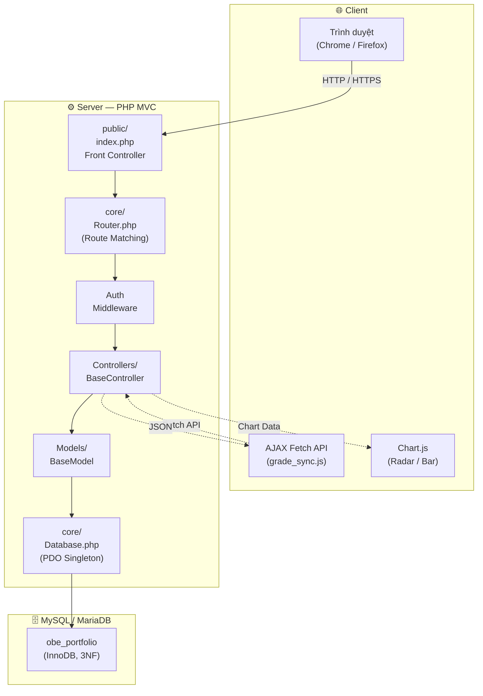
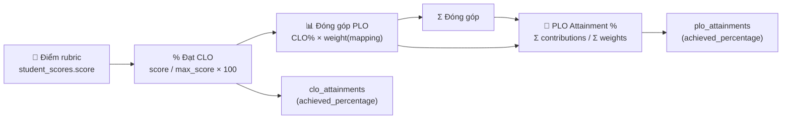

# 🎓 OBE & E-PortFOLIO SYSTEM
### iSchool 2026 — Đồ án Chuyên ngành PHP

> **Hệ thống Quản lý Chuẩn đầu ra (OBE) và E-Portfolio** — xây dựng trên PHP thuần, kiến trúc MVC tự triển khai, PDO Singleton, AJAX Fetch API, Chart.js.

[](https://www.php.net/)
[](https://dev.mysql.com/)
[]()

---

## 📁 Cấu trúc thư mục

```
obe_portfolio/
├── app/
│   ├── Controllers/
│   │   ├── AdminController.php      ← Quản lý program, PLO, course, users
│   │   ├── AuthController.php       ← Login, logout, session
│   │   ├── LecturerController.php   ← CLO, Assessment, Rubric
│   │   ├── ScoreController.php       ← Chấm điểm, API AJAX
│   │   └── StudentController.php     ← E-Portfolio, dashboard
│   ├── Models/
│   │   ├── AssessmentModel.php
│   │   └── ScoreModel.php           ← Thuật toán CLO→PLO attainment
│   └── Views/
│       ├── admin/                    ← Giao diện quản trị
│       ├── auth/                     ← Trang đăng nhập/đăng xuất
│       ├── errors/                   ← Trang lỗi 404/500
│       ├── layouts/                  ← main.php, auth.php
│       ├── lecturer/                 ← Giao diện giảng viên
│       └── student/                  ← Giao diện sinh viên
├── config/
│   └── database.php                  ← DB credentials
├── core/
│   ├── BaseController.php            ← Helper: view, redirect, json, CSRF
│   ├── BaseModel.php                 ← Generic CRUD
│   ├── Database.php                  ← PDO Singleton
│   └── Router.php                    ← URL routing engine
├── database/
│   └── schema.sql                    ← CSDL 3NF + seed data
├── docs/
│   ├── ERD.md                        ← Entity-Relationship Diagram
│   └── SITEMAP.md                    ← Site Map toàn hệ thống
└── public/                           ← Web root (trỏ Apache/Nginx vào đây)
    ├── index.php                     ← Front Controller
    ├── .htaccess                     ← Rewrite rules
    ├── css/app.css
    └── js/
        ├── app.js                    ← Toast, sidebar
        └── grade_sync.js             ← AJAX live grading engine
```

---

## 🏗️ Architecture Overview



---

## ⚙️ Cài đặt chi tiết (Hướng dẫn đầy đủ)

### Yêu cầu hệ thống

| Thành phần | Phiên bản tối thiểu | Khuyến nghị |
|-----------|---------------------|-------------|
| PHP | 8.1+ | 8.2 / 8.3 |
| MySQL | 8.0+ | 8.0 |
| Apache | 2.4+ | 2.4 (XAMPP) |
| mod_rewrite | Bật | Bật |
| php-mysqlnd | Bật | Bật |

---

### Bước 1: Cài đặt XAMPP

1. Tải **XAMPP** từ [apachefriends.org](https://www.apachefriends.org/) (chọn phiên bản **PHP 8.x + MySQL 8.x**)
2. Cài đặt → Next → Chọn **Apache** + **MySQL** → Next → Finish
3. Mở **XAMPP Control Panel** → Start **Apache** và **MySQL**

---

### Bước 2: Import Database Schema

**Cách 1 — Dùng phpMyAdmin (khuyến nghị):**

1. Mở trình duyệt → `http://localhost/phpmyadmin`
2. Tạo database mới: bấm **New** → đặt tên `obe_portfolio` → **Create**
3. Chọn database vừa tạo → bấm tab **Import**
4. Bấm **Choose File** → chọn file `database/schema.sql` trong thư mục project
5. Cuộn xuống → bấm **Go**

**Cách 2 — Dùng MySQL CLI:**

```bash
cd C:\xampp\mysql\bin
mysql -u root -p < C:\path\to\obe_portfolio\database\schema.sql
```

> Database `obe_portfolio` sẽ được tự động tạo cùng với 14 bảng và **seed data mẫu**.

---

### Bước 3: Cấu hình Database Credentials

Mở file `config/database.php`, đảm bảo nội dung đúng:

```php
<?php
return [
    'host'     => 'localhost',
    'port'     => '3306',
    'dbname'   => 'obe_portfolio',
    'username' => 'root',
    'password' => '',           // ← Mật khẩu MySQL của bạn (mặc định XAMPP: rỗng)
    'charset'  => 'utf8mb4',
];
```

> Nếu bạn đặt mật khẩu MySQL khi cài XAMPP, cập nhật giá trị `'password'` cho phù hợp.

---

### Bước 4: Cấu hình Apache VirtualHost

**Mở file VirtualHost config:**

```
C:\xampp\apache\conf\extra\httpd-vhosts.conf
```

**Thêm vào cuối file:**

```apache
<VirtualHost *:80>
    ServerName obe.local
    DocumentRoot "C:\path\to\obe_portfolio\public"

    <Directory "C:\path\to\obe_portfolio\public">
        Options Indexes FollowSymLinks
        AllowOverride All
        Require all granted
    </Directory>

    ErrorLog "logs/obe.local-error.log"
    CustomLog "logs/obe.local-access.log" combined
</VirtualHost>
```

> **Thay `C:\path\to\obe_portfolio` bằng đường dẫn thực tế trên máy bạn.**
> Ví dụ: `C:\Users\HLC\Documents\GitHub\OBE_Portfolio`

**Restart Apache:**

Mở **XAMPP Control Panel** → Stop **Apache** → Start **Apache**

---

### Bước 5: Thêm DNS Host (Windows)

**Mở Notepad với quyền Administrator:**

```
C:\Windows\System32\drivers\etc\hosts
```

**Thêm dòng sau vào cuối file:**

```
127.0.0.1   obe.local
```

Lưu file (Windows sẽ yêu cầu xác nhận UAC).

---

### Bước 6: Truy cập hệ thống

Mở trình duyệt → truy cập: **http://obe.local**

> Nếu không cấu hình VirtualHost, truy cập: **http://localhost/obe_portfolio/public**

---

## 🔑 Tài khoản Demo

| Vai trò | Username | Password | Mô tả |
|---------|----------|----------|--------|
| **Admin** (Trưởng khoa) | `admin01` | `password` | Quản lý chương trình, PLO, môn học, phân công, người dùng |
| **Giảng viên** | `lecturer01` | `password` | Quản lý CLO, ma trận ánh xạ, rubric, chấm điểm, báo cáo |
| **Sinh viên** | `student01` | `password` | Xem điểm, E-Portfolio, biểu đồ PLO |
| **Sinh viên** | `student02` | `password` | Xem điểm, E-Portfolio, biểu đồ PLO |

> Mật khẩu tất cả tài khoản: **`password`** (bcrypt hash)

---

## 📸 Screenshots

> *Thêm ảnh chụp màn hình vào thư mục `docs/screenshots/` để hiển thị tại đây.*

### Admin Dashboard


### Lecturer — Ma trận CLO→PLO


### Lecturer — Live Grading


### Student — E-Portfolio PLO Radar


---

## 🏗️ Các điểm nổi bật kiến trúc

### 1. MVC Pattern tự xây dựng
- **Router**: Pattern matching với named params (`:id`), middleware support, RESTful convention
- **BaseController**: View rendering với layout wrapping, JSON API responses, CSRF token generation
- **BaseModel**: Generic CRUD qua PDO Prepared Statements, relation helpers

### 2. PDO Singleton Pattern
```php
$db = Database::getInstance();         // Chỉ tạo 1 kết nối duy nhất
$db->fetchAll($sql, $params);         // Shorthand query helpers
$db->fetchOne($sql, $params);          // Single row
$db->execute($sql, $params);           // INSERT/UPDATE/DELETE
```

### 3. Thuật toán CLO→PLO Attainment (Core Business Logic)



```sql
-- Tính CLO attainment cho 1 sinh viên
CLO_achieved% = (SUM(score / max_score * 100) / COUNT(rubrics))
               WHERE rubrics.clo_id = clo_id

-- Tính PLO attainment cho 1 sinh viên
PLO_achieved% = SUM(CLO_achieved% * weight) / SUM(weight)
               WHERE mapping.plo_id = plo_id
```

> Sử dụng **Database Transaction** để đảm bảo tính nhất quán khi cập nhật `clo_attainments` và `plo_attainments`.

### 4. AJAX Live Grading (grade_sync.js)

| Tính năng | Mô tả |
|-----------|-------|
| Debounce 600ms | Không gửi request liên tục khi gõ |
| Visual feedback | 3 trạng thái: saving → saved → idle |
| Keyboard nav | Arrow keys, Enter di chuyển giữa các ô |
| Batch save | Ctrl+S lưu tất cả thay đổi |
| Client-side validation | Kiểm tra range trước khi gửi |
| Conflict resolution | Last-write-wins với timestamp |

### 5. Bảo mật

| Lớp bảo mật | Chi tiết |
|------------|----------|
| CSRF Protection | Token trên mọi form POST và API call |
| Password Hashing | bcrypt cost=12 |
| SQL Injection | PDO Prepared Statements (100%) |
| XSS Prevention | `htmlspecialchars()` trên mọi output |
| Session Security | Session regeneration sau login thành công |
| Rate Limiting | Random delay chống brute force |
| Security Headers | X-Frame-Options, X-XSS-Protection, X-Content-Type-Options |

---

## 📊 Database Schema (3NF)

> Xem chi tiết đầy đủ: [docs/ERD.md](docs/ERD.md)

### 14 Bảng chính

| # | Bảng | Mô tả | Quan hệ chính |
|---|------|-------|--------------|
| 1 | `users` | Người dùng (admin/lecturer/student) | FK: programs, course_assignments, enrollments |
| 2 | `programs` | Chương trình đào tạo | 1:N → plos, courses |
| 3 | `plos` | Program Learning Outcomes | FK: programs; 1:N ↔ clo_plo_mappings |
| 4 | `courses` | Môn học | FK: programs; 1:N → course_assignments |
| 5 | `course_assignments` | Phân công giảng viên | FK: courses, users; 1:N → enrollments, assessments |
| 6 | `enrollments` | Sinh viên đăng ký môn | FK: users, course_assignments |
| 7 | `clos` | Course Learning Outcomes | FK: courses; 1:N → clo_plo_mappings, rubrics |
| 8 | **`clo_plo_mappings`** | **Ma trận ánh xạ CLO→PLO (linh hồn OBE)** | PK kép (clo_id, plo_id) |
| 9 | `assessments` | Bài kiểm tra (quiz/assignment/midterm/final/project/lab) | FK: course_assignments; 1:N → rubrics |
| 10 | `rubrics` | Tiêu chí chấm điểm | FK: assessments, clos; 1:N → student_scores |
| 11 | `student_scores` | Điểm sinh viên theo rubric | FK: users, rubrics |
| 12 | `clo_attainments` | Mức đạt CLO (computed, tự động) | PK kép (student_id, clo_id) |
| 13 | `plo_attainments` | Mức đạt PLO (computed, dùng cho radar chart) | PK kép (student_id, plo_id) |
| 14 | `activity_logs` | Audit trail toàn hệ thống | FK: users (SET NULL) |

---

## 🗺️ Site Map

> Xem chi tiết đầy đủ: [docs/SITEMAP.md](docs/SITEMAP.md)

```
/auth/login          ← Trang đăng nhập
├── /admin/*         ← Nhóm Admin (8 trang con)
│   ├── programs / plos / courses / assignments / users / activity-logs
├── /lecturer/*      ← Nhóm Giảng viên (11 trang con)
│   ├── course/:id / clos / mapping / assessments / rubrics / grade / report
└── /student/*      ← Nhóm Sinh viên (6 trang con)
    ├── course/:id / scores / portfolio / plos / activity
```

---

## 🗣️ Gợi ý bảo vệ đồ án (Viva Pitching)

**Điểm 1 — Độ phức tạp nghiệp vụ:**
> "Hệ thống không chỉ là CRUD thông thường. Chúng em triển khai thuật toán Data Aggregation 2 tầng: từ điểm rubric → CLO attainment → PLO attainment, sử dụng Weighted Average với ma trận ánh xạ linh hoạt do giảng viên định nghĩa."

**Điểm 2 — Trải nghiệm người dùng:**
> "Live Grading hoạt động như Google Sheets: nhập điểm, debounce 600ms, gửi Fetch API, phản hồi trực quan qua màu sắc. Giảng viên điều hướng bằng Arrow Keys, lưu hàng loạt bằng Ctrl+S."

**Điểm 3 — Kiến trúc phần mềm:**
> "MVC tự xây dựng với Router hỗ trợ named params và middleware. PDO Singleton đảm bảo single connection. Transaction bảo vệ tính nhất quán khi tính attainment. CSRF token trên mọi mutation request."

---

## 📄 Tài liệu tham khảo

| Tài liệu | Mô tả |
|----------|-------|
| [docs/ERD.md](docs/ERD.md) | Entity-Relationship Diagram đầy đủ với 14 bảng |
| [docs/SITEMAP.md](docs/SITEMAP.md) | Site Map chi tiết tất cả route |
| [database/schema.sql](database/schema.sql) | Source SQL schema + seed data |
