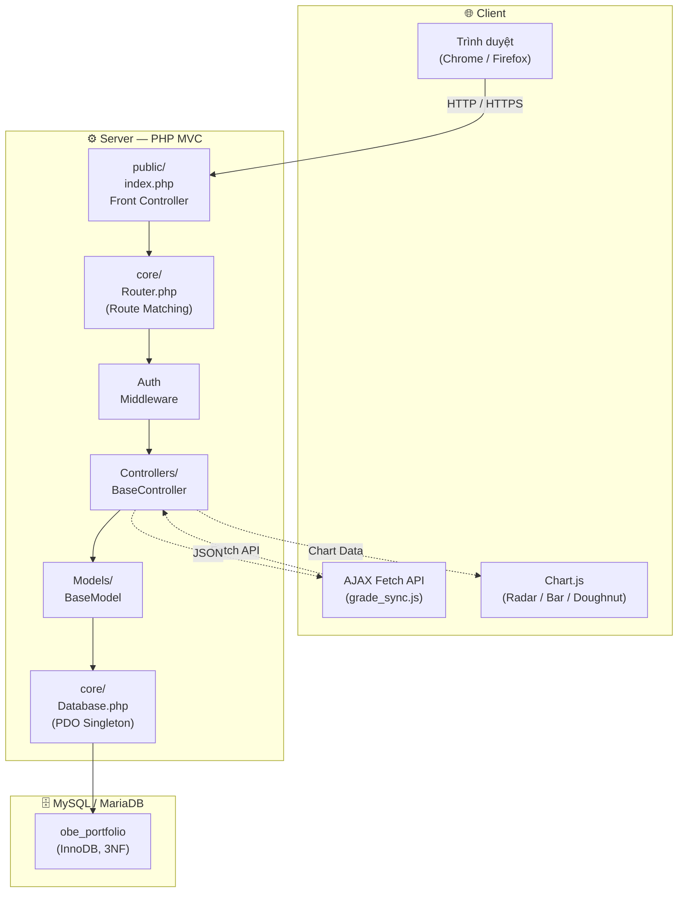
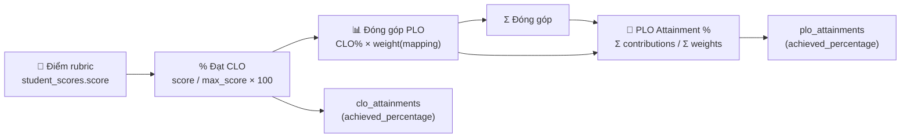

# 🎓 OBE & E-Portfolio System
### iSchool 2026 — Đồ án Chuyên ngành PHP

> **Hệ thống Quản lý Chuẩn đầu ra (OBE) và E-Portfolio** — xây dựng trên PHP thuần, kiến trúc MVC tự triển khai, PDO Singleton, AJAX Fetch API, Chart.js.

[](https://www.php.net/)
[](https://dev.mysql.com/)
[]()

---

## Giới thiệu

**OBE & E-Portfolio System** là hệ thống quản lý đào tạo theo mô hình **Outcome-Based Education (OBE)** — một phương pháp giáo dục tập trung vào kết quả đầu ra cụ thể mà người học cần đạt được. Hệ thống được xây dựng hoàn toàn bằng **PHP thuần**, không sử dụng framework, thể hiện khả năng kiến trúc phần mềm và kỹ năng lập trình của sinh viên.

Hệ thống phục vụ ba nhóm người dùng chính:

| Nhóm | Vai trò | Mô tả |
|------|---------|--------|
| **Trưởng khoa** | Admin | Quản lý chương trình đào tạo, PLO, môn học, phân công giảng viên, người dùng |
| **Giảng viên** | Lecturer | Quản lý CLO, ma trận ánh xạ CLO→PLO, tạo rubric, chấm điểm live, báo cáo |
| **Sinh viên** | Student | Xem điểm, E-Portfolio cá nhân, biểu đồ PLO Radar Chart |

### OBE là gì?

**Outcome-Based Education (OBE)** là triết lý giáo dục đặt kết quả học tập (learning outcomes) làm trung tâm của quá trình giảng dạy. Hệ thống này theo dõi chuỗi năng lực:

```
PLO (Program Learning Outcome)
    ↑ định nghĩa bởi chương trình đào tạo
        ↑
CLO (Course Learning Outcome)
    ↑ được ánh xạ từ CLO thông qua ma trận CLO→PLO
        ↑
Điểm rubric (Student Score)
    ↑ được chấm bởi giảng viên
```

---

## Tính năng chính

### Quản lý Admin
- **Chương trình đào tạo (Program):** Tạo, sửa, xóa với ràng buộc FK
- **PLO Management:** Chuẩn đầu ra chương trình với phân loại Knowledge/Skill/Attitude
- **Môn học (Course):** CRUD với validation mã học phần
- **Phân công giảng viên:** Liên kết GV-môn-học kỳ, chống trùng lặp
- **Quản lý người dùng:** Tạo/khoá tài khoản, phân quyền admin/lecturer/student
- **Activity Logs:** Audit trail toàn hệ thống, lọc theo vai trò/hành động/ngày
- **Báo cáo PLO Attainment:** Tổng hợp mức đạt PLO toàn chương trình, top sinh viên xuất sắc

### Quản lý Giảng viên
- **CLO Management:** Tạo CLO với Bloom's Taxonomy Level (1-6)
- **Ma trận CLO→PLO:** Trọng số đóng góp linh hoạt, lưu tức thời
- **Assessment & Rubric:** CRUD bài kiểm tra + tiêu chí chấm điểm
- **Live Grading:** Bảng chấm điểm Google-Sheets-style, debounce 600ms, keyboard navigation
- **Thống kê real-time:** Điểm trung bình, min/max, % hoàn thành theo rubric

### E-Portfolio Sinh viên
- **Dashboard tổng quan:** % năng lực tổng thể, số PLO đạt chuẩn, môn học đang theo
- **Radar Chart:** Biểu đồ PLO với ngưỡng 70% tham chiếu
- **CLO Breakdown:** Chi tiết % đạt theo từng môn và CLO
- **Hoạt động chấm điểm:** Bảng điểm gần nhất với timeline

---

## Yêu cầu hệ thống

| Thành phần | Phiên bản tối thiểu | Khuyến nghị |
|------------|---------------------|-------------|
| PHP | 8.1+ | 8.2 / 8.3 |
| MySQL | 8.0+ | 8.0 |
| Apache | 2.4+ | 2.4 (XAMPP) |
| mod_rewrite | Bật | Bật |
| php-mysqlnd | Bật | Bật |
| Browser | Chrome 90+ / Firefox 88+ / Edge 90+ | Chrome 115+ |

---

## Hướng dẫn cài đặt

### Bước 1: Cài đặt XAMPP

1. Tải **XAMPP** từ [apachefriends.org](https://www.apachefriends.org/) (chọn phiên bản **PHP 8.x + MySQL 8.x**)
2. Cài đặt → Next → Chọn **Apache** + **MySQL** → Next → Finish
3. Mở **XAMPP Control Panel** → Start **Apache** và **MySQL**

### Bước 2: Import Database Schema

**Cách 1 — Dùng phpMyAdmin (khuyến nghị):**

1. Mở trình duyệt → `http://localhost/phpmyadmin`
2. Tạo database mới: bấm **New** → đặt tên `obe_portfolio` → **Create**
3. Chọn database vừa tạo → bấm tab **Import**
4. Bấm **Choose File** → chọn file `database/schema.sql` trong thư mục project
5. Cuộn xuống → bấm **Go**

**Cách 2 — Dùng MySQL CLI:**

```bash
cd C:\xampp\mysql\bin
mysql -u root -p < C:\path\to\obe_portfolio\database\schema.sql
```

> Database `obe_portfolio` sẽ được tự động tạo cùng với 14 bảng và **seed data mẫu**.

### Bước 3: Cấu hình Database Credentials

Mở file `config/database.php`, đảm bảo nội dung đúng:

```php
<?php
return [
    'host'     => 'localhost',
    'port'     => '3306',
    'dbname'   => 'obe_portfolio',
    'username' => 'root',
    'password' => '',           // ← Mật khẩu MySQL của bạn (mặc định XAMPP: rỗng)
    'charset'  => 'utf8mb4',
];
```

> Nếu bạn đặt mật khẩu MySQL khi cài XAMPP, cập nhật giá trị `'password'` cho phù hợp.

### Bước 4: Cấu hình Apache VirtualHost (tùy chọn nhưng khuyến nghị)

**Mở file VirtualHost config:**

```
C:\xampp\apache\conf\extra\httpd-vhosts.conf
```

**Thêm vào cuối file:**

```apache
<VirtualHost *:80>
    ServerName obe.local
    DocumentRoot "C:\path\to\obe_portfolio\public"

    <Directory "C:\path\to\obe_portfolio\public">
        Options Indexes FollowSymLinks
        AllowOverride All
        Require all granted
    </Directory>

    ErrorLog "logs/obe.local-error.log"
    CustomLog "logs/obe.local-access.log" combined
</VirtualHost>
```

> **Thay `C:\path\to\obe_portfolio` bằng đường dẫn thực tế trên máy bạn.**

**Restart Apache:** Mở **XAMPP Control Panel** → Stop **Apache** → Start **Apache**

### Bước 5: Thêm DNS Host (Windows) — chỉ khi dùng VirtualHost

**Mở Notepad với quyền Administrator:**

```
C:\Windows\System32\drivers\etc\hosts
```

**Thêm dòng sau vào cuối file:**

```
127.0.0.1   obe.local
```

Lưu file (Windows sẽ yêu cầu xác nhận UAC).

### Bước 6: Truy cập hệ thống

Mở trình duyệt → truy cập: **http://obe.local**

> Nếu không cấu hình VirtualHost, truy cập: **http://localhost/[tên-thư-mục]/public**

---

## Hướng dẫn sử dụng

### Luồng thiết lập OBE toàn hệ thống

```
1. Admin tạo Program (CTĐT)
      ↓
2. Admin tạo PLO (cho Program)
      ↓
3. Admin tạo Course (thuộc Program)
      ↓
4. Admin phân công Giảng viên
      ↓
5. Giảng viên tạo CLO (cho Course)
      ↓
6. Giảng viên tạo ma trận CLO→PLO
      ↓
7. Giảng viên tạo Assessment + Rubric
      ↓
8. Giảng viên chấm điểm (Live Grading)
      ↓
9. Hệ thống tự động tính CLO Attainment
      ↓
10. Hệ thống tự động tính PLO Attainment
      ↓
11. Sinh viên xem E-Portfolio (Radar Chart)
```

### Cách đăng nhập với từng vai trò

Sử dụng tài khoản demo có sẵn trong seed data:

| Vai trò | Username | Password | Mô tả |
|---------|----------|----------|--------|
| **Admin** | `admin01` | `password` | Quản lý CTĐT, PLO, môn học, phân công, người dùng |
| **Giảng viên** | `lecturer01` | `password` | Quản lý CLO, ma trận, rubric, chấm điểm, báo cáo |
| **Sinh viên** | `student01` | `password` | Xem E-Portfolio, điểm, biểu đồ PLO |
| **Sinh viên** | `student02` | `password` | Xem E-Portfolio, điểm, biểu đồ PLO |

> Mật khẩu tất cả tài khoản: **`password`** (bcrypt hash)

### Cách tạo chương trình đào tạo (Program)

1. Đăng nhập với vai trò **Admin**
2. Vào **Chương trình đào tạo** từ sidebar
3. Bấm **"Thêm chương trình"**
4. Điền:
   - **Mã chương trình**: `ITEC2024` (2-20 ký tự, chữ hoa, số)
   - **Tên chương trình**: `Công nghệ Thông tin K2024`
   - **Mô tả**: Tùy chọn
5. Bấm **"Tạo mới"**

### Cách tạo PLO (Program Learning Outcome)

1. Vào **Chương trình đào tạo** → Bấm biểu tượng ⭐ bên cạnh CTĐT
2. Bấm **"Thêm PLO"**
3. Điền:
   - **Mã PLO**: `PLO1`
   - **Mô tả**: Mô tả năng lực cần đạt
   - **Danh mục**: Knowledge / Skill / Attitude

### Cách tạo CLO và map với PLO

1. Đăng nhập với vai trò **Giảng viên**
2. Vào **Tổng quan giảng dạy** → Môn học → **CLO**
3. Bấm **"Thêm CLO"** → Nhập mã và mô tả
4. Vào **Ma trận** → Nhập trọng số (%) cho mỗi cặp CLO-PLO
5. Bấm **"Lưu"**

> Ma trận CLO→PLO là **linh hồn của hệ thống OBE** — xác định mức đóng góp của từng CLO vào các PLO.

### Cách phân công giảng viên

1. Đăng nhập với vai trò **Admin**
2. Vào **Môn học** → Mở modal tạo/sửa môn học
3. Chọn **Giảng viên** và **Học kỳ** (VD: `2024-1`)

### Cách chấm điểm sinh viên

1. Vào Dashboard giảng viên → Bấm **"Chấm điểm →"** ở bài kiểm tra
2. Nhập điểm vào bảng — tự động lưu sau 600ms
3. Dùng **Arrow Keys** di chuyển giữa các ô
4. Dùng **Ctrl+S** để lưu tất cả thay đổi
5. Bấm **"Xác nhận hoàn thành"** khi xong

### Cách sinh viên xem Portfolio

1. Đăng nhập với vai trò **Sinh viên**
2. Dashboard hiển thị tự động:
   - **Radar Chart**: Biểu đồ PLO với ngưỡng 70%
   - **Thanh progress**: Từng PLO theo mức đạt
   - **CLO breakdown**: Chi tiết theo từng môn học

### Cách xem báo cáo PLO Attainment

1. Đăng nhập với vai trò **Admin** hoặc **Giảng viên**
2. Vào **Báo cáo đạt chuẩn PLO**
3. Chọn **Chương trình đào tạo** từ dropdown
4. Xem bảng PLO với % trung bình, số SV đạt, Top sinh viên

---

## Cấu trúc thư mục

```
obe_portfolio/
├── app/
│   ├── Controllers/
│   │   ├── AdminController.php      # Dashboard, Program, PLO, Course, User, Log
│   │   ├── AuthController.php       # Login, logout, session
│   │   ├── LecturerController.php   # CLO, Assessment, Rubric
│   │   ├── StudentController.php     # E-Portfolio, dashboard
│   │   └── ScoreController.php      # Live grading, API AJAX
│   ├── Models/
│   │   ├── ScoreModel.php          # Thuật toán CLO→PLO attainment
│   │   └── AssessmentModel.php      # CRUD Assessment
│   └── Views/
│       ├── admin/                   # Giao diện quản trị
│       ├── auth/                    # Trang đăng nhập
│       ├── layouts/                 # main.php, auth.php
│       ├── lecturer/                # Giao diện giảng viên
│       ├── student/                # Giao diện sinh viên
│       └── errors/                 # 403, 404
├── config/
│   └── database.php               # DB credentials
├── core/
│   ├── BaseController.php          # view(), redirect(), json(), csrfToken()
│   ├── BaseModel.php              # Generic CRUD
│   ├── Database.php               # PDO Singleton
│   ├── Router.php                 # URL routing
│   └── AuthService.php            # Authentication logic
├── database/
│   └── schema.sql                 # 14 bảng 3NF + seed data
├── docs/
│   ├── ERD.md                    # Entity-Relationship Diagram
│   ├── SITEMAP.md               # Site Map
│   ├── folder-structure.md       # Chi tiết cấu trúc
│   ├── features.md              # Hướng dẫn tính năng
│   ├── database-schema.md       # Mô tả chi tiết bảng
│   └── screenshots/             # Ảnh chụp màn hình
└── public/
    ├── index.php                # Front Controller
    ├── .htaccess               # Rewrite rules
    ├── css/app.css             # Stylesheet chính
    └── js/
        ├── app.js              # Toast, sidebar, filter
        └── grade_sync.js       # AJAX live grading engine
```

---

## Liên kết ERD & Tài liệu

| Tài liệu | Mô tả |
|----------|--------|
| [docs/ERD.md](docs/ERD.md) | Entity-Relationship Diagram đầy đủ với 14 bảng |
| [docs/SITEMAP.md](docs/SITEMAP.md) | Site Map chi tiết tất cả route |
| [docs/folder-structure.md](docs/folder-structure.md) | Chi tiết cấu trúc thư mục |
| [docs/features.md](docs/features.md) | Hướng dẫn chi tiết từng tính năng |
| [docs/database-schema.md](docs/database-schema.md) | Mô tả chi tiết 14 bảng & ràng buộc |
| [database/schema.sql](database/schema.sql) | Source SQL schema + seed data |

---

## Ảnh chụp màn hình

> Các ảnh chụp màn hình được lưu trong `docs/screenshots/`. Để cập nhật:
> 1. Truy cập hệ thống tại `http://obe.local` (hoặc cổng tương ứng)
> 2. Chụp ảnh từng trang chính
> 3. Lưu vào `docs/screenshots/` với tên mô tả (VD: `admin-dashboard.png`)
> 4. Cập nhật đường dẫn trong README này

### Admin Dashboard


*Dashboard quản trị hiển thị: thống kê SV/GV/Môn học/PLO, biểu đồ Bar SV theo CTĐT, biểu đồ Doughnut tỷ lệ đạt PLO, thanh tiến trình từng PLO, thao tác nhanh, và feed hoạt động gần đây.*

### Admin — Quản lý Chương trình đào tạo


*Giao diện quản lý CTĐT với bảng danh sách có sắp xếp theo cột, tìm kiếm, phân trang, và modal tạo/sửa/xóa.*

### Admin — Quản lý PLO


*Giao diện quản lý PLO cho từng chương trình đào tạo, hiển thị mã PLO, mô tả, danh mục, số CLO đã map, và mức đạt trung bình.*

### Admin — Báo cáo PLO Attainment


*Báo cáo tổng hợp PLO Attainment: bảng chi tiết từng PLO với % trung bình, số SV đạt/không đạt, thanh progress, và danh sách Top 10 sinh viên xuất sắc.*

### Giảng viên — Dashboard


*Dashboard giảng viên hiển thị: môn học đang phụ trách (số SV, số bài KT), danh sách bài kiểm tra cần chấm điểm với progress bar.*

### Giảng viên — Live Grading


*Giao diện chấm điểm live với bảng pivot sinh viên × rubric, điểm tự động lưu, keyboard navigation, toolbar với nút Lưu tất cả và Xác nhận hoàn thành.*

### Sinh viên — E-Portfolio Dashboard


*Trang E-Portfolio sinh viên với: stats tổng quan, Radar Chart PLO với ngưỡng 70%, thanh progress từng PLO, và CLO breakdown theo môn học.*

### Trang Đăng nhập


*Trang đăng nhập với thiết kế hiện đại, toggle hiện/ẩn mật khẩu, và xử lý lỗi đăng nhập.*

---

## Kiến trúc hệ thống

### Architecture Overview



### PDO Singleton Pattern

```php
$db = Database::getInstance();      // Chỉ tạo 1 kết nối duy nhất
$db->fetchAll($sql, $params);       // Shorthand query helpers
$db->fetchOne($sql, $params);       // Single row
$db->execute($sql, $params);        // INSERT/UPDATE/DELETE
```

### Thuật toán CLO→PLO Attainment (Core Business Logic)



```sql
-- Tầng 1: CLO Attainment (cho 1 SV, 1 CLO)
CLO_achieved% = SUM(score) / SUM(max_score) × 100
               WHERE rubrics.clo_id = clo_id
               AND assessments.is_published = 1

-- Tầng 2: PLO Attainment (weighted average)
PLO_achieved% = SUM(CLO_achieved% × weight) / SUM(weight)
                WHERE mapping.plo_id = plo_id
```

> Sử dụng **Database Transaction** để đảm bảo tính nhất quán khi cập nhật `clo_attainments` và `plo_attainments`.

### AJAX Live Grading (grade_sync.js)

| Tính năng | Mô tả |
|-----------|--------|
| Debounce 600ms | Không gửi request liên tục khi gõ |
| Visual feedback | 3 trạng thái: saving → saved → idle |
| Keyboard nav | Arrow keys di chuyển, Enter xuống dòng, Tab mặc định |
| Batch save | Ctrl+S lưu tất cả thay đổi |
| Client validation | Kiểm tra range trước khi gửi |
| Progress bar | Thanh tiến độ chấm điểm toàn bài |
| Confirm modal | Xác nhận hoàn thành trước khi redirect |

### Bảo mật

| Lớp bảo mật | Chi tiết |
|-------------|----------|
| CSRF Protection | Token trên mọi form POST và API call |
| Password Hashing | bcrypt cost=12 |
| SQL Injection | 100% PDO Prepared Statements |
| XSS Prevention | `htmlspecialchars()` trên mọi output |
| Session Security | Session regeneration sau login thành công |
| Rate Limiting | Random delay chống brute force |
| Security Headers | X-Frame-Options, X-XSS-Protection, X-Content-Type-Options |
| Role Middleware | Kiểm tra vai trò trước mỗi action |

---

## Công nghệ sử dụng

| Công nghệ | Phiên bản | Mô tả |
|-----------|----------|--------|
| **PHP** | 8.1+ | Ngôn ngữ backend, pure OOP |
| **MySQL** | 8.0+ | Hệ quản trị cơ sở dữ liệu |
| **Apache** | 2.4+ | Web server (XAMPP) |
| **Chart.js** | 4.x | Biểu đồ Radar, Bar, Doughnut |
| **Native JS (ES6+)** | — | AJAX Fetch API, debounce, keyboard nav |
| **CSS Variables** | — | Design system với custom properties |
| **PDO** | — | Database abstraction layer |
| **bcrypt** | — | Password hashing (cost=12) |
| **Mermaid** | — | Sơ đồ ERD & flowchart trong markdown |

---

## Gợi ý bảo vệ đồ án (Viva Pitching)

**Điểm 1 — Độ phức tạp nghiệp vụ:**
> "Hệ thống không chỉ là CRUD thông thường. Chúng em triển khai thuật toán Data Aggregation 2 tầng: từ điểm rubric → CLO attainment → PLO attainment, sử dụng Weighted Average với ma trận ánh xạ linh hoạt do giảng viên định nghĩa."

**Điểm 2 — Trải nghiệm người dùng:**
> "Live Grading hoạt động như Google Sheets: nhập điểm, debounce 600ms, gửi Fetch API, phản hồi trực quan qua màu sắc. Giảng viên điều hướng bằng Arrow Keys, lưu hàng loạt bằng Ctrl+S."

**Điểm 3 — Kiến trúc phần mềm:**
> "MVC tự xây dựng với Router hỗ trợ named params và middleware. PDO Singleton đảm bảo single connection. Transaction bảo vệ tính nhất quán khi tính attainment. CSRF token trên mọi mutation request."

**Điểm 4 — Hạ tầng dữ liệu:**
> "Cơ sở dữ liệu 14 bảng chuẩn 3NF, InnoDB engine, đầy đủ FK constraints, UNIQUE constraints, CHECK constraints. Seed data demo có sẵn 4 tài khoản, 1 CTĐT, 5 PLO, 2 môn học, 5 CLO với ma trận đầy đủ."

---

## Tài liệu tham khảo

| Tài liệu | Mô tả |
|----------|--------|
| [docs/ERD.md](docs/ERD.md) | Entity-Relationship Diagram đầy đủ với 14 bảng |
| [docs/SITEMAP.md](docs/SITEMAP.md) | Site Map chi tiết tất cả route |
| [docs/folder-structure.md](docs/folder-structure.md) | Chi tiết cấu trúc thư mục |
| [docs/features.md](docs/features.md) | Hướng dẫn chi tiết từng workflow |
| [docs/database-schema.md](docs/database-schema.md) | Mô tả chi tiết 14 bảng & ràng buộc |
| [database/schema.sql](database/schema.sql) | Source SQL schema + seed data |

---

*OBE & E-Portfolio System — iSchool 2026*
