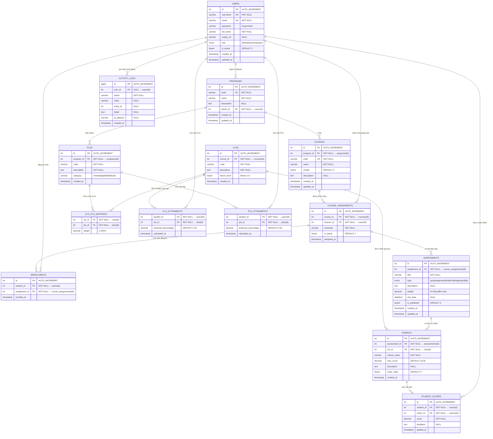

# Entity-Relationship Diagram (ERD)

> **OBE & E-Portfolio System** — 14 bảng, chuẩn 3NF, Engine InnoDB

---

## Liên kết & Cardinality

| # | Bảng 1 | Bảng 2 | Kiểu | Mô tả |
|---|--------|--------|------|-------|
| 1 | `users` | `programs` | 1:N | Admin quản lý chương trình đào tạo |
| 2 | `users` | `course_assignments` | 1:N | Giảng viên được phân công giảng dạy |
| 3 | `users` | `enrollments` | 1:N | Sinh viên đăng ký học phần |
| 4 | `users` | `student_scores` | 1:N | Sinh viên được chấm điểm theo rubric |
| 5 | `users` | `clo_attainments` | 1:N | Sinh viên có mức đạt CLO |
| 6 | `users` | `plo_attainments` | 1:N | Sinh viên có mức đạt PLO |
| 7 | `users` | `activity_logs` | 1:N | Mọi hành động được ghi log |
| 8 | `programs` | `plos` | 1:N | Chương trình có nhiều PLO |
| 9 | `programs` | `courses` | 1:N | Chương trình chứa nhiều môn học |
| 10 | `courses` | `course_assignments` | 1:N | Môn học được phân công giảng viên |
| 11 | `course_assignments` | `enrollments` | 1:N | Phân công có nhiều sinh viên đăng ký |
| 12 | `course_assignments` | `assessments` | 1:N | Phân công có nhiều bài đánh giá |
| 13 | `clos` | `clo_plo_mappings` | 1:N | CLO tham gia nhiều ánh xạ PLO |
| 14 | `plos` | `clo_plo_mappings` | 1:N | PLO được ánh xạ từ nhiều CLO |
| 15 | `assessments` | `rubrics` | 1:N | Bài đánh giá có nhiều tiêu chí |
| 16 | `clos` | `rubrics` | 1:N | CLO được đánh giá qua rubric |
| 17 | `rubrics` | `student_scores` | 1:N | Mỗi sinh viên có 1 điểm / rubric |
| 18 | `clos` | `clo_attainments` | 1:N | CLO có mức đạt cho mỗi sinh viên |
| 19 | `plos` | `plo_attainments` | 1:N | PLO có mức đạt cho mỗi sinh viên |

---

## Ràng buộc đặc biệt

| Ràng buộc | Bảng | Chi tiết |
|-----------|------|----------|
| UK | `plos` | `(program_id, code)` — không trùng mã PLO trong cùng chương trình |
| UK | `clos` | `(course_id, code)` — không trùng mã CLO trong cùng môn học |
| UK | `course_assignments` | `(course_id, lecturer_id, semester)` — mỗi GV chỉ 1 phân công/môn/học kỳ |
| UK | `enrollments` | `(student_id, assignment_id)` — sinh viên không đăng ký trùng |
| UK | `student_scores` | `(student_id, rubric_id)` — mỗi SV 1 điểm duy nhất / rubric |
| PK kép | `clo_plo_mappings` | `(clo_id, plo_id)` — mỗi cặp CLO-PLO chỉ 1 dòng |
| PK kép | `clo_attainments` | `(student_id, clo_id)` |
| PK kép | `plo_attainments` | `(student_id, plo_id)` |
| CHECK | `clo_plo_mappings` | `weight BETWEEN 0 AND 100` |
| CASCADE | hầu hết FK | Xóa cha → xóa con để giữ tính nhất quán |
| RESTRICT | `programs.admin_id` | Không xóa admin đang quản lý chương trình |
| RESTRICT | `rubrics.clo_id` | Không xóa CLO đang được rubric tham chiếu |
| SET NULL | `activity_logs.user_id` | Giữ lại log khi user bị xóa |
