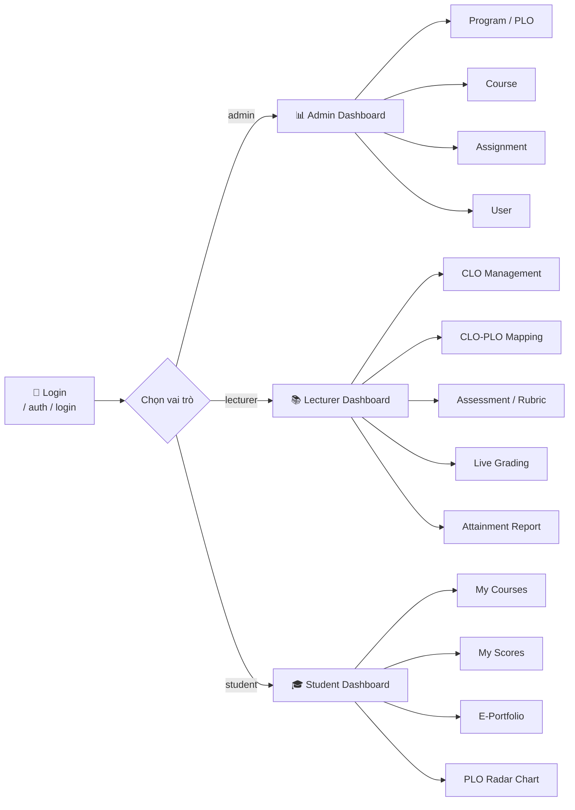

# Site Map — OBE & E-Portfolio System

> Tổng quan toàn bộ trang trong hệ thống, phân theo 3 nhóm vai trò: **Admin**, **Lecturer (Giảng viên)**, **Student (Sinh viên)**

---

## Biểu đồ Site Map

```mermaid
flowchart TB
    subgraph PUB["🔓 Công khai"]
        LOGIN["/auth/login\nTrang đăng nhập"]
        LOGOUT["/auth/logout\nĐăng xuất"]
    end

    subgraph ADMIN["🛡️ Nhóm Admin"]
        ADMIN_DASH["/admin\nDashboard Quản trị"]
        ADMIN_PROGRAMS["/admin/programs\nQuản lý Chương trình đào tạo"]
        ADMIN_PLO["/admin/programs/:id/plos\nQuản lý PLO"]
        ADMIN_COURSES["/admin/courses\nQuản lý Môn học"]
        ADMIN_ASSIGN["/admin/assignments\nPhân công Giảng viên"]
        ADMIN_USERS["/admin/users\nQuản lý Người dùng"]
        ADMIN_ACTIVITY["/admin/activity-logs\nNhật ký Hoạt động"]
    end

    subgraph LECTURER["👨‍🏫 Nhóm Giảng viên"]
        LECT_DASH["/lecturer\nDashboard Giảng viên"]
        LECT_COURSE["/lecturer/course/:id\nChi tiết Môn học"]
        LECT_CLO["/lecturer/course/:id/clos\nQuản lý CLO"]
        LECT_MAPPING["/lecturer/course/:id/mapping\nMa trận CLO→PLO"]
        LECT_ASSESS["/lecturer/assessments\nQuản lý Bài đánh giá"]
        LECT_RUBRIC["/lecturer/assessments/:id/rubrics\nQuản lý Rubric"]
        LECT_GRADE["/lecturer/grade/:assessment_id\nChấm điểm Live Grading"]
        LECT_REPORT["/lecturer/report/:assignment_id\nBáo cáo Attainment"]
        LECT_STUDENT["/lecturer/students\nDanh sách Sinh viên"]
    end

    subgraph STUDENT["🎓 Nhóm Sinh viên"]
        STUD_DASH["/student\nDashboard Sinh viên"]
        STUD_COURSE["/student/course/:id\nChi tiết Môn học"]
        STUD_SCORE["/student/scores/:course_id\nXem Điểm & CLO"]
        STUD_PORTFOLIO["/student/portfolio\nE-Portfolio của tôi"]
        STUD_PLO["/student/portfolio/plos\nBáo cáo PLO Attainment"]
        STUD_ACTIVITY["/student/activity\nHoạt động của tôi"]
    end

    %% Entry
    LOGIN --> ADMIN_DASH
    LOGIN --> LECT_DASH
    LOGIN --> STUD_DASH

    ADMIN_DASH --> ADMIN_PROGRAMS
    ADMIN_DASH --> ADMIN_COURSES
    ADMIN_DASH --> ADMIN_USERS
    ADMIN_DASH --> ADMIN_ACTIVITY

    ADMIN_PROGRAMS --> ADMIN_PLO
    ADMIN_COURSES --> ADMIN_ASSIGN

    LECT_DASH --> LECT_COURSE
    LECT_DASH --> LECT_ASSESS
    LECT_DASH --> LECT_REPORT
    LECT_DASH --> LECT_STUDENT

    LECT_COURSE --> LECT_CLO
    LECT_COURSE --> LECT_MAPPING
    LECT_CLO --> LECT_MAPPING

    LECT_ASSESS --> LECT_RUBRIC
    LECT_RUBRIC --> LECT_GRADE

    STUD_DASH --> STUD_COURSE
    STUD_DASH --> STUD_PORTFOLIO

    STUD_COURSE --> STUD_SCORE
    STUD_PORTFOLIO --> STUD_PLO
```

---

## Danh sách Route chi tiết

### Nhóm Công khai (Public)

| Method | Route | Mô tả |
|--------|-------|-------|
| GET | `/` | Redirect → `/auth/login` |
| GET | `/auth/login` | Trang đăng nhập |
| POST | `/auth/login` | Xử lý đăng nhập |
| GET/POST | `/auth/logout` | Đăng xuất, hủy session |

---

### Nhóm Admin (Vai trò: `admin`)

| Method | Route | Mô tả |
|--------|-------|-------|
| GET | `/admin` | Dashboard quản trị tổng quan |
| GET | `/admin/programs` | Danh sách chương trình đào tạo |
| GET/POST | `/admin/programs/create` | Tạo chương trình mới |
| GET/POST | `/admin/programs/:id/edit` | Chỉnh sửa chương trình |
| POST | `/admin/programs/:id/delete` | Xóa chương trình |
| GET | `/admin/programs/:id/plos` | Danh sách PLO của chương trình |
| GET/POST | `/admin/programs/:id/plos/create` | Thêm PLO mới |
| GET/POST | `/admin/plos/:id/edit` | Chỉnh sửa PLO |
| POST | `/admin/plos/:id/delete` | Xóa PLO |
| GET | `/admin/courses` | Danh sách môn học |
| GET/POST | `/admin/courses/create` | Tạo môn học mới |
| GET/POST | `/admin/courses/:id/edit` | Chỉnh sửa môn học |
| POST | `/admin/courses/:id/delete` | Xóa môn học |
| GET | `/admin/assignments` | Danh sách phân công giảng viên |
| GET/POST | `/admin/assignments/create` | Phân công giảng viên |
| GET/POST | `/admin/assignments/:id/edit` | Chỉnh sửa phân công |
| POST | `/admin/assignments/:id/delete` | Xóa phân công |
| GET | `/admin/users` | Danh sách người dùng |
| GET/POST | `/admin/users/create` | Tạo người dùng mới |
| GET/POST | `/admin/users/:id/edit` | Chỉnh sửa người dùng |
| POST | `/admin/users/:id/delete` | Xóa người dùng |
| GET | `/admin/activity-logs` | Nhật ký hoạt động toàn hệ thống |
| GET | `/admin/activity-logs/export` | Xuất log ra file |

---

### Nhóm Giảng viên (Vai trò: `lecturer`)

| Method | Route | Mô tả |
|--------|-------|-------|
| GET | `/lecturer` | Dashboard giảng viên |
| GET | `/lecturer/course/:id` | Chi tiết môn học được phân công |
| GET | `/lecturer/course/:id/clos` | Quản lý CLO của môn học |
| GET/POST | `/lecturer/course/:id/clos/create` | Thêm CLO mới |
| GET/POST | `/lecturer/clos/:id/edit` | Chỉnh sửa CLO |
| POST | `/lecturer/clos/:id/delete` | Xóa CLO |
| GET | `/lecturer/course/:id/mapping` | Ma trận ánh xạ CLO→PLO |
| POST | `/lecturer/course/:id/mapping/save` | Lưu ma trận ánh xạ |
| GET | `/lecturer/assessments` | Danh sách bài đánh giá |
| GET/POST | `/lecturer/assessments/create` | Tạo bài đánh giá mới |
| GET/POST | `/lecturer/assessments/:id/edit` | Chỉnh sửa bài đánh giá |
| POST | `/lecturer/assessments/:id/toggle-publish` | Bật/tắt công khai |
| POST | `/lecturer/assessments/:id/delete` | Xóa bài đánh giá |
| GET | `/lecturer/assessments/:id/rubrics` | Quản lý Rubric |
| GET/POST | `/lecturer/assessments/:id/rubrics/create` | Thêm tiêu chí chấm điểm |
| GET/POST | `/lecturer/rubrics/:id/edit` | Chỉnh sửa Rubric |
| POST | `/lecturer/rubrics/:id/delete` | Xóa Rubric |
| GET | `/lecturer/grade/:assessment_id` | Trang chấm điểm Live Grading |
| POST | `/lecturer/grade/save` | API lưu điểm (AJAX) |
| POST | `/lecturer/grade/batch-save` | API lưu hàng loạt (Ctrl+S) |
| GET | `/lecturer/report/:assignment_id` | Báo cáo CLO/PLO Attainment |
| GET | `/lecturer/report/:assignment_id/export` | Xuất báo cáo PDF/Excel |
| GET | `/lecturer/students` | Danh sách sinh viên trong lớp |
| GET | `/lecturer/students/:id/profile` | Xem hồ sơ sinh viên |

---

### Nhóm Sinh viên (Vai trò: `student`)

| Method | Route | Mô tả |
|--------|-------|-------|
| GET | `/student` | Dashboard sinh viên — khóa học đã đăng ký |
| GET | `/student/course/:id` | Chi tiết môn học |
| GET | `/student/scores/:course_id` | Xem điểm theo từng CLO |
| GET | `/student/scores/:course_id/export` | Xuất bảng điểm cá nhân |
| GET | `/student/portfolio` | E-Portfolio tổng quan |
| GET | `/student/portfolio/plos` | Biểu đồ PLO Attainment (Radar Chart) |
| GET | `/student/portfolio/plos/export` | Xuất báo cáo PLO PDF |
| GET | `/student/activity` | Hoạt động học tập của tôi |

---

## Luồng điều hướng chính

---

## Ghi chú về Middleware bảo mật

| Middleware | Áp dụng cho | Chức năng |
|-----------|-------------|-----------|
| `AuthMiddleware` | Tất cả route `/admin/*`, `/lecturer/*`, `/student/*` | Kiểm tra đăng nhập & session |
| `RoleMiddleware` | Mỗi nhóm route | Chỉ cho phép đúng vai trò |
| `CsrfMiddleware` | Tất cả POST/PUT/DELETE | Bảo vệ CSRF token |
| `ActivityLogMiddleware` | Tất cả mutation request | Ghi log hành động vào `activity_logs` |
