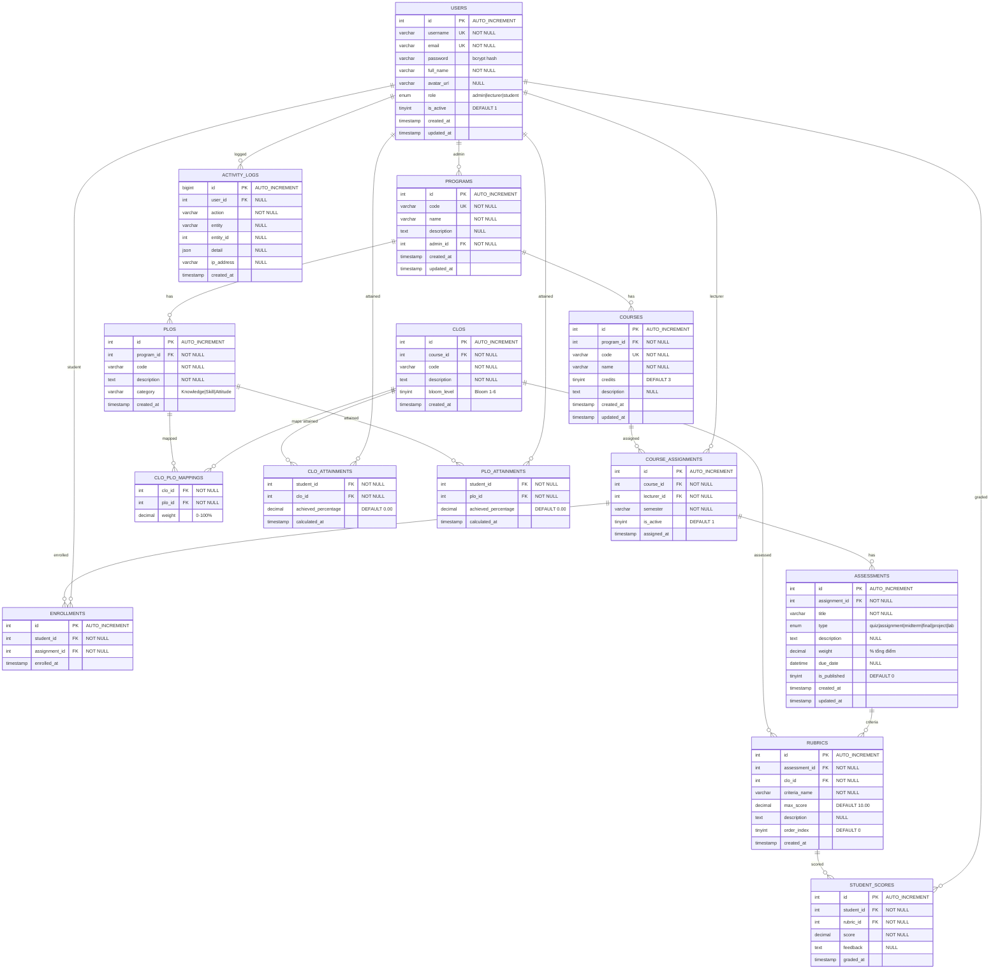

# Database Schema — OBE & E-Portfolio System

> Mô tả chi tiết 14 bảng cơ sở dữ liệu MySQL (3NF, InnoDB). Viết bằng tiếng Việt.

---

## Tổng quan

| # | Bảng | Mô tả | Kiểu quan hệ |
|---|------|-------|--------------|
| 1 | `users` | Người dùng hệ thống | Entity chính |
| 2 | `programs` | Chương trình đào tạo | 1:N → `plos`, `courses` |
| 3 | `plos` | Program Learning Outcomes | FK → `programs` |
| 4 | `courses` | Môn học | FK → `programs` |
| 5 | `course_assignments` | Phân công giảng viên | FK → `courses`, `users` |
| 6 | `enrollments` | Sinh viên đăng ký môn | FK → `users`, `course_assignments` |
| 7 | `clos` | Course Learning Outcomes | FK → `courses` |
| 8 | `clo_plo_mappings` | Ma trận ánh xạ CLO→PLO | PK kép, FK → `clos`, `plos` |
| 9 | `assessments` | Bài kiểm tra / đánh giá | FK → `course_assignments` |
| 10 | `rubrics` | Tiêu chí chấm điểm | FK → `assessments`, `clos` |
| 11 | `student_scores` | Điểm sinh viên theo rubric | FK → `users`, `rubrics` |
| 12 | `clo_attainments` | Mức đạt CLO (computed) | PK kép, FK → `users`, `clos` |
| 13 | `plo_attainments` | Mức đạt PLO (computed) | PK kép, FK → `users`, `plos` |
| 14 | `activity_logs` | Nhật ký hoạt động | Audit trail |

---

## Chi tiết từng bảng

### 1. `users` — Người dùng

```sql
CREATE TABLE `users` (
    `id`         INT UNSIGNED  NOT NULL AUTO_INCREMENT,
    `username`   VARCHAR(60)  NOT NULL UNIQUE,
    `email`      VARCHAR(120) NOT NULL UNIQUE,
    `password`   VARCHAR(255) NOT NULL,           -- bcrypt hash
    `full_name`  VARCHAR(120) NOT NULL,
    `avatar_url` VARCHAR(255) DEFAULT NULL,
    `role`       ENUM('admin','lecturer','student') NOT NULL DEFAULT 'student',
    `is_active`  TINYINT(1)   NOT NULL DEFAULT 1,
    `created_at` TIMESTAMP    NOT NULL DEFAULT CURRENT_TIMESTAMP,
    `updated_at` TIMESTAMP    NOT NULL DEFAULT CURRENT_TIMESTAMP ON UPDATE CURRENT_TIMESTAMP,
    PRIMARY KEY (`id`),
    KEY `idx_role` (`role`)
);
```

| Trường | Kiểu | Mô tả |
|---------|------|--------|
| `id` | INT UNSIGNED PK | ID tự tăng |
| `username` | VARCHAR(60) UNIQUE | Tên đăng nhập |
| `email` | VARCHAR(120) UNIQUE | Email |
| `password` | VARCHAR(255) | bcrypt hash (cost=12) |
| `full_name` | VARCHAR(120) | Họ tên đầy đủ |
| `avatar_url` | VARCHAR(255) NULL | URL avatar |
| `role` | ENUM | `admin` / `lecturer` / `student` |
| `is_active` | TINYINT(1) | 1=hoạt động, 0=bị khoá |

**Ghi chú:** Bảng `users` là entity trung tâm. Mỗi người dùng có vai trò xác định và ảnh hưởng đến toàn bộ hệ thống.

---

### 2. `programs` — Chương trình đào tạo

```sql
CREATE TABLE `programs` (
    `id`          INT UNSIGNED NOT NULL AUTO_INCREMENT,
    `code`        VARCHAR(20)  NOT NULL UNIQUE,
    `name`        VARCHAR(255) NOT NULL,
    `description` TEXT         DEFAULT NULL,
    `admin_id`    INT UNSIGNED NOT NULL,
    `created_at`  TIMESTAMP    NOT NULL DEFAULT CURRENT_TIMESTAMP,
    `updated_at`  TIMESTAMP    NOT NULL DEFAULT CURRENT_TIMESTAMP ON UPDATE CURRENT_TIMESTAMP,
    PRIMARY KEY (`id`),
    FOREIGN KEY (`admin_id`) REFERENCES `users`(`id`) ON DELETE RESTRICT
);
```

| Trường | Kiểu | Mô tả |
|---------|------|--------|
| `id` | INT UNSIGNED PK | ID tự tăng |
| `code` | VARCHAR(20) UNIQUE | Mã CTĐT (VD: `ITEC2024`) |
| `name` | VARCHAR(255) | Tên đầy đủ |
| `description` | TEXT NULL | Mô tả |
| `admin_id` | INT UNSIGNED FK | Admin quản lý CTĐT |

**Ghi chú:** `admin_id` FK có `ON DELETE RESTRICT` — không xóa admin đang quản lý CTĐT.

---

### 3. `plos` — Program Learning Outcomes

```sql
CREATE TABLE `plos` (
    `id`          INT UNSIGNED NOT NULL AUTO_INCREMENT,
    `program_id`  INT UNSIGNED NOT NULL,
    `code`        VARCHAR(10)  NOT NULL,
    `description` TEXT         NOT NULL,
    `category`    VARCHAR(60)  DEFAULT NULL,
    `created_at`  TIMESTAMP    NOT NULL DEFAULT CURRENT_TIMESTAMP,
    PRIMARY KEY (`id`),
    UNIQUE KEY `uq_program_plo_code` (`program_id`, `code`),
    FOREIGN KEY (`program_id`) REFERENCES `programs`(`id`) ON DELETE CASCADE
);
```

| Trường | Kiểu | Mô tả |
|---------|------|--------|
| `id` | INT UNSIGNED PK | ID tự tăng |
| `program_id` | INT UNSIGNED FK | Chương trình cha |
| `code` | VARCHAR(10) | Mã PLO (VD: `PLO1`) |
| `description` | TEXT | Mô tả năng lực |
| `category` | VARCHAR(60) | Knowledge / Skill / Attitude |

**UNIQUE constraint:** `(program_id, code)` — không trùng mã PLO trong cùng chương trình.

---

### 4. `courses` — Môn học

```sql
CREATE TABLE `courses` (
    `id`          INT UNSIGNED NOT NULL AUTO_INCREMENT,
    `program_id`  INT UNSIGNED NOT NULL,
    `code`        VARCHAR(20)  NOT NULL UNIQUE,
    `name`        VARCHAR(255) NOT NULL,
    `credits`     TINYINT UNSIGNED NOT NULL DEFAULT 3,
    `description` TEXT         DEFAULT NULL,
    `created_at`  TIMESTAMP    NOT NULL DEFAULT CURRENT_TIMESTAMP,
    `updated_at`  TIMESTAMP    NOT NULL DEFAULT CURRENT_TIMESTAMP ON UPDATE CURRENT_TIMESTAMP,
    PRIMARY KEY (`id`),
    FOREIGN KEY (`program_id`) REFERENCES `programs`(`id`) ON DELETE CASCADE
);
```

| Trường | Kiểu | Mô tả |
|---------|------|--------|
| `id` | INT UNSIGNED PK | ID tự tăng |
| `program_id` | INT UNSIGNED FK | Chương trình cha |
| `code` | VARCHAR(20) UNIQUE | Mã môn (VD: `ITEC2201`) |
| `name` | VARCHAR(255) | Tên môn học |
| `credits` | TINYINT UNSIGNED | Số tín chỉ (mặc định 3) |

---

### 5. `course_assignments` — Phân công giảng viên

```sql
CREATE TABLE `course_assignments` (
    `id`          INT UNSIGNED NOT NULL AUTO_INCREMENT,
    `course_id`   INT UNSIGNED NOT NULL,
    `lecturer_id` INT UNSIGNED NOT NULL,
    `semester`    VARCHAR(20)  NOT NULL,
    `is_active`   TINYINT(1)   NOT NULL DEFAULT 1,
    `assigned_at` TIMESTAMP    NOT NULL DEFAULT CURRENT_TIMESTAMP,
    PRIMARY KEY (`id`),
    UNIQUE KEY `uq_assignment` (`course_id`, `lecturer_id`, `semester`),
    FOREIGN KEY (`course_id`)   REFERENCES `courses`(`id`)  ON DELETE CASCADE,
    FOREIGN KEY (`lecturer_id`) REFERENCES `users`(`id`)   ON DELETE CASCADE
);
```

| Trường | Kiểu | Mô tả |
|---------|------|--------|
| `id` | INT UNSIGNED PK | ID tự tăng |
| `course_id` | INT UNSIGNED FK | Môn học |
| `lecturer_id` | INT UNSIGNED FK | Giảng viên |
| `semester` | VARCHAR(20) | Học kỳ (VD: `2024-1`) |
| `is_active` | TINYINT(1) | Có đang giảng dạy không |

**UNIQUE constraint:** `(course_id, lecturer_id, semester)` — không trùng phân công.

---

### 6. `enrollments` — Sinh viên đăng ký môn

```sql
CREATE TABLE `enrollments` (
    `id`            INT UNSIGNED NOT NULL AUTO_INCREMENT,
    `student_id`    INT UNSIGNED NOT NULL,
    `assignment_id` INT UNSIGNED NOT NULL,
    `enrolled_at`   TIMESTAMP    NOT NULL DEFAULT CURRENT_TIMESTAMP,
    PRIMARY KEY (`id`),
    UNIQUE KEY `uq_enrollment` (`student_id`, `assignment_id`),
    FOREIGN KEY (`student_id`)    REFERENCES `users`(`id`)               ON DELETE CASCADE,
    FOREIGN KEY (`assignment_id`) REFERENCES `course_assignments`(`id`)  ON DELETE CASCADE
);
```

| Trường | Kiểu | Mô tả |
|---------|------|--------|
| `id` | INT UNSIGNED PK | ID tự tăng |
| `student_id` | INT UNSIGNED FK | Sinh viên |
| `assignment_id` | INT UNSIGNED FK | Phân công giảng viên |

**UNIQUE constraint:** `(student_id, assignment_id)` — sinh viên không đăng ký trùng.

---

### 7. `clos` — Course Learning Outcomes

```sql
CREATE TABLE `clos` (
    `id`          INT UNSIGNED NOT NULL AUTO_INCREMENT,
    `course_id`   INT UNSIGNED NOT NULL,
    `code`        VARCHAR(10)  NOT NULL,
    `description` TEXT         NOT NULL,
    `bloom_level` TINYINT UNSIGNED DEFAULT NULL,
    `created_at`  TIMESTAMP    NOT NULL DEFAULT CURRENT_TIMESTAMP,
    PRIMARY KEY (`id`),
    UNIQUE KEY `uq_course_clo_code` (`course_id`, `code`),
    FOREIGN KEY (`course_id`) REFERENCES `courses`(`id`) ON DELETE CASCADE
);
```

| Trường | Kiểu | Mô tả |
|---------|------|--------|
| `id` | INT UNSIGNED PK | ID tự tăng |
| `course_id` | INT UNSIGNED FK | Môn học cha |
| `code` | VARCHAR(10) | Mã CLO (VD: `CLO1`) |
| `description` | TEXT | Mô tả năng lực |
| `bloom_level` | TINYINT UNSIGNED NULL | Bloom's Taxonomy 1-6 |

---

### 8. `clo_plo_mappings` — Ma trận ánh xạ CLO→PLO ⭐

```sql
CREATE TABLE `clo_plo_mappings` (
    `clo_id`  INT UNSIGNED    NOT NULL,
    `plo_id`  INT UNSIGNED    NOT NULL,
    `weight`  DECIMAL(5,2)   NOT NULL DEFAULT 100.00,
    PRIMARY KEY (`clo_id`, `plo_id`),
    CONSTRAINT `chk_weight` CHECK (`weight` >= 0 AND `weight` <= 100),
    FOREIGN KEY (`clo_id`) REFERENCES `clos`(`id`) ON DELETE CASCADE,
    FOREIGN KEY (`plo_id`) REFERENCES `plos`(`id`) ON DELETE CASCADE
);
```

| Trường | Kiểu | Mô tả |
|---------|------|--------|
| `clo_id` | INT UNSIGNED FK (PK) | CLO nguồn |
| `plo_id` | INT UNSIGNED FK (PK) | PLO đích |
| `weight` | DECIMAL(5,2) | Trọng số đóng góp (0-100%) |

**Ghi chú:** Đây là **bảng cốt lõi** của hệ thống OBE. Mỗi dòng = mức đóng góp của 1 CLO vào 1 PLO.

---

### 9. `assessments` — Bài kiểm tra / đánh giá

```sql
CREATE TABLE `assessments` (
    `id`            INT UNSIGNED NOT NULL AUTO_INCREMENT,
    `assignment_id` INT UNSIGNED NOT NULL,
    `title`         VARCHAR(255) NOT NULL,
    `type`          ENUM('quiz','assignment','midterm','final','project','lab') NOT NULL,
    `description`   TEXT         DEFAULT NULL,
    `weight`        DECIMAL(5,2) NOT NULL DEFAULT 0.00,
    `due_date`      DATETIME     DEFAULT NULL,
    `is_published`  TINYINT(1)   NOT NULL DEFAULT 0,
    `created_at`    TIMESTAMP    NOT NULL DEFAULT CURRENT_TIMESTAMP,
    `updated_at`    TIMESTAMP    NOT NULL DEFAULT CURRENT_TIMESTAMP ON UPDATE CURRENT_TIMESTAMP,
    PRIMARY KEY (`id`),
    FOREIGN KEY (`assignment_id`) REFERENCES `course_assignments`(`id`) ON DELETE CASCADE
);
```

| Trường | Kiểu | Mô tả |
|---------|------|--------|
| `id` | INT UNSIGNED PK | ID tự tăng |
| `assignment_id` | INT UNSIGNED FK | Phân công GV |
| `title` | VARCHAR(255) | Tên bài kiểm tra |
| `type` | ENUM | quiz/assignment/midterm/final/project/lab |
| `description` | TEXT NULL | Mô tả |
| `weight` | DECIMAL(5,2) | % trong tổng điểm môn |
| `due_date` | DATETIME NULL | Hạn nộp |
| `is_published` | TINYINT(1) | 1=sinh viên thấy |

---

### 10. `rubrics` — Tiêu chí chấm điểm

```sql
CREATE TABLE `rubrics` (
    `id`             INT UNSIGNED NOT NULL AUTO_INCREMENT,
    `assessment_id`  INT UNSIGNED NOT NULL,
    `clo_id`         INT UNSIGNED NOT NULL,
    `criteria_name`  VARCHAR(255) NOT NULL,
    `max_score`      DECIMAL(6,2) NOT NULL DEFAULT 10.00,
    `description`    TEXT         DEFAULT NULL,
    `order_index`    TINYINT UNSIGNED NOT NULL DEFAULT 0,
    `created_at`     TIMESTAMP    NOT NULL DEFAULT CURRENT_TIMESTAMP,
    PRIMARY KEY (`id`),
    FOREIGN KEY (`assessment_id`) REFERENCES `assessments`(`id`) ON DELETE CASCADE,
    FOREIGN KEY (`clo_id`)        REFERENCES `clos`(`id`)        ON DELETE RESTRICT
);
```

| Trường | Kiểu | Mô tả |
|---------|------|--------|
| `id` | INT UNSIGNED PK | ID tự tăng |
| `assessment_id` | INT UNSIGNED FK | Bài kiểm tra |
| `clo_id` | INT UNSIGNED FK | CLO được đánh giá |
| `criteria_name` | VARCHAR(255) | Tên tiêu chí |
| `max_score` | DECIMAL(6,2) | Điểm tối đa (mặc định 10) |
| `description` | TEXT NULL | Mô tả chi tiết tiêu chí |
| `order_index` | TINYINT UNSIGNED | Thứ tự hiển thị |

**Ghi chú:** `clo_id` có `ON DELETE RESTRICT` — không xóa CLO đang được rubric sử dụng.

---

### 11. `student_scores` — Điểm sinh viên

```sql
CREATE TABLE `student_scores` (
    `id`         INT UNSIGNED NOT NULL AUTO_INCREMENT,
    `student_id` INT UNSIGNED NOT NULL,
    `rubric_id`  INT UNSIGNED NOT NULL,
    `score`      DECIMAL(6,2) NOT NULL,
    `feedback`   TEXT         DEFAULT NULL,
    `graded_at`  TIMESTAMP    NOT NULL DEFAULT CURRENT_TIMESTAMP ON UPDATE CURRENT_TIMESTAMP,
    PRIMARY KEY (`id`),
    UNIQUE KEY `uq_student_rubric` (`student_id`, `rubric_id`),
    FOREIGN KEY (`student_id`) REFERENCES `users`(`id`)    ON DELETE CASCADE,
    FOREIGN KEY (`rubric_id`)  REFERENCES `rubrics`(`id`) ON DELETE CASCADE
);
```

| Trường | Kiểu | Mô tả |
|---------|------|--------|
| `id` | INT UNSIGNED PK | ID tự tăng |
| `student_id` | INT UNSIGNED FK | Sinh viên |
| `rubric_id` | INT UNSIGNED FK | Tiêu chí |
| `score` | DECIMAL(6,2) | Điểm đạt được |
| `feedback` | TEXT NULL | Nhận xét của GV |
| `graded_at` | TIMESTAMP | Thời gian chấm |

**UNIQUE constraint:** `(student_id, rubric_id)` — upsert trên Rubric, không chấm trùng.

---

### 12. `clo_attainments` — Mức đạt CLO

```sql
CREATE TABLE `clo_attainments` (
    `student_id`          INT UNSIGNED  NOT NULL,
    `clo_id`              INT UNSIGNED  NOT NULL,
    `achieved_percentage` DECIMAL(5,2)  NOT NULL DEFAULT 0.00,
    `calculated_at`       TIMESTAMP     NOT NULL DEFAULT CURRENT_TIMESTAMP ON UPDATE CURRENT_TIMESTAMP,
    PRIMARY KEY (`student_id`, `clo_id`),
    FOREIGN KEY (`student_id`) REFERENCES `users`(`id`) ON DELETE CASCADE,
    FOREIGN KEY (`clo_id`)     REFERENCES `clos`(`id`)  ON DELETE CASCADE
);
```

| Trường | Kiểu | Mô tả |
|---------|------|--------|
| `student_id` | INT UNSIGNED FK (PK) | Sinh viên |
| `clo_id` | INT UNSIGNED FK (PK) | CLO được đo |
| `achieved_percentage` | DECIMAL(5,2) | % đạt được (tự động tính) |
| `calculated_at` | TIMESTAMP | Thời gian tính lần cuối |

> Bảng này được **tự động cập nhật** mỗi khi giảng viên lưu điểm.

---

### 13. `plo_attainments` — Mức đạt PLO (E-Portfolio)

```sql
CREATE TABLE `plo_attainments` (
    `student_id`          INT UNSIGNED  NOT NULL,
    `plo_id`              INT UNSIGNED  NOT NULL,
    `achieved_percentage` DECIMAL(5,2)  NOT NULL DEFAULT 0.00,
    `calculated_at`       TIMESTAMP     NOT NULL DEFAULT CURRENT_TIMESTAMP ON UPDATE CURRENT_TIMESTAMP,
    PRIMARY KEY (`student_id`, `plo_id`),
    FOREIGN KEY (`student_id`) REFERENCES `users`(`id`) ON DELETE CASCADE,
    FOREIGN KEY (`plo_id`)     REFERENCES `plos`(`id`)  ON DELETE CASCADE
);
```

| Trường | Kiểu | Mô tả |
|---------|------|--------|
| `student_id` | INT UNSIGNED FK (PK) | Sinh viên |
| `plo_id` | INT UNSIGNED FK (PK) | PLO được đo |
| `achieved_percentage` | DECIMAL(5,2) | % đạt được (weighted average) |
| `calculated_at` | TIMESTAMP | Thời gian tính lần cuối |

> Đây là dữ liệu chính hiển thị trên **E-Portfolio Radar Chart** của sinh viên.

---

### 14. `activity_logs` — Nhật ký hoạt động

```sql
CREATE TABLE `activity_logs` (
    `id`         BIGINT UNSIGNED NOT NULL AUTO_INCREMENT,
    `user_id`    INT UNSIGNED    DEFAULT NULL,
    `action`     VARCHAR(60)     NOT NULL,
    `entity`     VARCHAR(60)     DEFAULT NULL,
    `entity_id`  INT UNSIGNED    DEFAULT NULL,
    `detail`     JSON            DEFAULT NULL,
    `ip_address` VARCHAR(45)     DEFAULT NULL,
    `created_at` TIMESTAMP       NOT NULL DEFAULT CURRENT_TIMESTAMP,
    PRIMARY KEY (`id`),
    KEY `idx_user_action` (`user_id`, `action`),
    FOREIGN KEY (`user_id`) REFERENCES `users`(`id`) ON DELETE SET NULL
);
```

| Trường | Kiểu | Mô tả |
|---------|------|--------|
| `id` | BIGINT UNSIGNED PK | ID tự tăng |
| `user_id` | INT UNSIGNED FK NULL | User thực hiện (NULL = system) |
| `action` | VARCHAR(60) | Hành động (VD: `login`, `Create program`) |
| `entity` | VARCHAR(60) NULL | Đối tượng bị tác động |
| `entity_id` | INT UNSIGNED NULL | ID đối tượng |
| `detail` | JSON NULL | Chi tiết bổ sung |
| `ip_address` | VARCHAR(45) | IPv4/IPv6 address |
| `created_at` | TIMESTAMP | Thời gian |

---

## Quan hệ ERD (Mermaid)



---

## Ràng buộc đặc biệt

| Ràng buộc | Bảng | Chi tiết |
|-----------|------|----------|
| UNIQUE | `programs.code` | Mã CTĐT không trùng |
| UNIQUE | `plos` | `(program_id, code)` — không trùng mã PLO trong CTĐT |
| UNIQUE | `courses.code` | Mã môn học không trùng |
| UNIQUE | `course_assignments` | `(course_id, lecturer_id, semester)` — 1 phân công/môn/GV/học kỳ |
| UNIQUE | `enrollments` | `(student_id, assignment_id)` — không đăng ký trùng |
| UNIQUE | `clos` | `(course_id, code)` — không trùng mã CLO trong môn |
| UNIQUE | `clo_plo_mappings` | `(clo_id, plo_id)` — PK kép |
| UNIQUE | `student_scores` | `(student_id, rubric_id)` — 1 điểm duy nhất / SV / rubric |
| PK kép | `clo_attainments` | `(student_id, clo_id)` |
| PK kép | `plo_attainments` | `(student_id, plo_id)` |
| CHECK | `clo_plo_mappings` | `weight BETWEEN 0 AND 100` |
| CASCADE | Hầu hết FK | Xóa cha → xóa con |
| RESTRICT | `programs.admin_id` | Không xóa admin đang quản lý CTĐT |
| RESTRICT | `rubrics.clo_id` | Không xóa CLO đang được rubric dùng |
| SET NULL | `activity_logs.user_id` | Giữ lại log khi user bị xóa |

---

## Seed Data (Demo)

| username | email | role | password |
|----------|-------|------|---------|
| `admin01` | admin@ischool.edu.vn | admin | `password` |
| `lecturer01` | gv01@ischool.edu.vn | lecturer | `password` |
| `student01` | sv01@student.ischool.vn | student | `password` |
| `student02` | sv02@student.ischool.vn | student | `password` |

> Mật khẩu tất cả tài khoản demo: **`password`** (bcrypt hash: `$2y$12$92IXUNpkjO0rOQ5byMi.Ye4oKoEa3Ro9llC/.og/at2.uheWG/igi`)
