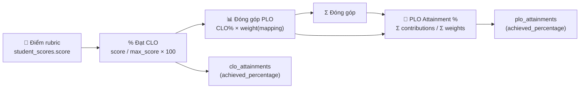

# Tính năng chi tiết — OBE & E-Portfolio System

> Hướng dẫn sử dụng từng tính năng, workflow nghiệp vụ, và thuật toán cốt lõi. Viết bằng tiếng Việt.

---

## Mục lục

1. [Quy trình thiết lập OBE](#1-quy-trình-thiết-lập-obe)
2. [Quản lý chương trình đào tạo (Program)](#2-quản-lý-chương-trình-đào-tạo-program)
3. [Quản lý PLO (Program Learning Outcome)](#3-quản-lý-plo)
4. [Quản lý môn học (Course)](#4-quản-lý-môn-học-course)
5. [Phân công giảng viên](#5-phân-công-giảng-viên)
6. [Quản lý CLO (Course Learning Outcome)](#6-quản-lý-clo)
7. [Ma trận ánh xạ CLO→PLO](#7-ma-trận-ánh-xạ-clo→plo)
8. [Quản lý Assessment và Rubric](#8-quản-lý-assessment-và-rubric)
9. [Live Grading — Chấm điểm thời gian thực](#9-live-grading--chấm-điểm-thời-gian-thực)
10. [Thuật toán CLO→PLO Attainment](#10-thuật-toán-clo→plo-attainment)
11. [E-Portfolio — Trang cá nhân sinh viên](#11-e-portfolio--trang-cá-nhân-sinh-viên)
12. [Báo cáo PLO Attainment](#12-báo-cáo-plo-attainment)
13. [Quản lý người dùng & Bảo mật](#13-quản-lý-người-dùng--bảo-mật)

---

## 1. Quy trình thiết lập OBE

### Tổng quan luồng thiết lập

```
Admin tạo Program
    ↓
Admin tạo PLO (cho Program)
    ↓
Admin tạo Course (thuộc Program)
    ↓
Admin phân công Giảng viên
    ↓
Giảng viên tạo CLO (cho Course)
    ↓
Giảng viên tạo ma trận CLO→PLO
    ↓
Giảng viên tạo Assessment + Rubric
    ↓
Giảng viên chấm điểm (Live Grading)
    ↓
Hệ thống tự động tính CLO Attainment
    ↓
Hệ thống tự động tính PLO Attainment
    ↓
Sinh viên xem E-Portfolio (Radar Chart)
```

---

## 2. Quản lý chương trình đào tạo (Program)

**Route:** `/admin/programs`  
**Controller:** `AdminController::programs()`  
**Quyền:** Admin

### Tạo chương trình mới

1. Đăng nhập với tài khoản `admin01 / password`
2. Vào **Chương trình đào tạo** từ sidebar hoặc Dashboard
3. Bấm nút **"Thêm chương trình"**
4. Điền thông tin:
   - **Mã chương trình**: `ITEC2024` (2-20 ký tự, chữ hoa, số, gạch ngang)
   - **Tên chương trình**: `Công nghệ Thông tin K2024`
   - **Mô tả**: Mô tả ngắn về chương trình (tùy chọn)
5. Bấm **"Tạo mới"**

> **Validation:** Mã chương trình phải là duy nhất (UNIQUE). Không thể xóa chương trình đã có môn học gắn kết.

### Các thao tác khác

- **Sắp xếp**: Bấm vào tiêu đề cột (Mã, Tên, Môn học, PLO, GV phụ trách, Sinh viên, Ngày tạo)
- **Tìm kiếm**: Thanh search theo mã hoặc tên
- **Phân trang**: 20 kết quả/trang
- **Sửa**: Nút bút chì → mở modal chỉnh sửa
- **Xóa**: Nút thùng rác → xác nhận trước khi xóa

---

## 3. Quản lý PLO

**Route:** `/admin/program/:id/plos`  
**Controller:** `AdminController::plos()`  
**Quyền:** Admin

### PLO là gì?

**PLO (Program Learning Outcome)** là Chuẩn đầu ra chương trình đào tạo — những năng lực mà sinh viên cần đạt được khi tốt nghiệp. Mỗi PLO thuộc một chương trình đào tạo và có phân loại:

| Phân loại | Mô tả |
|-----------|--------|
| **Knowledge** | Kiến thức chuyên môn |
| **Skill** | Kỹ năng thực hành |
| **Attitude** | Thái độ, đạo đức nghề nghiệp |

### Tạo PLO

1. Vào **Chương trình đào tạo** → Bấm biểu tượng ⭐ bên cạnh CTĐT
2. Bấm **"Thêm PLO"**
3. Điền thông tin:
   - **Mã PLO**: `PLO1` (duy nhất trong chương trình)
   - **Mô tả**: Mô tả chi tiết năng lực
   - **Danh mục**: Knowledge / Skill / Attitude
4. Bấm **"Tạo mới"**

### Hiển thị trên Dashboard Admin

Dashboard hiển thị thanh tiến trình cho từng PLO:
- Màu xanh (≥70%): Đạt chuẩn
- Màu vàng (50-69%): Cần cải thiện
- Màu đỏ (<50%): Chưa đạt

---

## 4. Quản lý môn học (Course)

**Route:** `/admin/courses`  
**Controller:** `AdminController::courses()`  
**Quyền:** Admin

### Tạo môn học

1. Vào **Môn học** từ sidebar
2. Bấm **"Thêm môn học"**
3. Điền thông tin:
   - **Chương trình**: Chọn CTĐT mà môn này thuộc về
   - **Mã môn học**: `ITEC2201` (định dạng: 2-6 chữ + 2-4 số + chữ cái tùy chọn)
   - **Tên môn học**: `Lập trình Web Nâng cao`
   - **Số tín chỉ**: 3 (1-10)
   - **Mô tả**: Tùy chọn
4. Bấm **"Tạo mới"**

> **Validation:** Mã môn học là duy nhất toàn cục. Môn học không thể xóa nếu có sinh viên đăng ký.

---

## 5. Phân công giảng viên

**Route:** `/admin/assignments` (quản lý)  
**Controller:** `AdminController::storeAssignment()`  
**Quyền:** Admin

### Ý nghĩa

`course_assignments` liên kết **một giảng viên** với **một môn học** trong **một học kỳ** cụ thể.

### Phân công

1. Vào **Môn học** → mở modal tạo/sửa môn học
2. Chọn **Giảng viên** được phân công
3. Nhập **Học kỳ**: `2024-1`, `2024-2`, `2025-1`...
4. Bấm **"Tạo mới"**

> **Validation:** Không trùng lặp: cùng môn + cùng giảng viên + cùng học kỳ = 1 phân công duy nhất.

---

## 6. Quản lý CLO

**Route:** `/lecturer/assignment/:id/clos`  
**Controller:** `LecturerController::clos()`  
**Quyền:** Giảng viên, Admin

### CLO là gì?

**CLO (Course Learning Outcome)** là Chuẩn đầu ra môn học — những năng lực cụ thể mà sinh viên đạt được sau khi hoàn thành môn học.

### Bloom's Taxonomy

Mỗi CLO có **Bloom's Taxonomy Level** (1-6):

| Cấp độ | Tên | Mô tả |
|---------|------|--------|
| 1 | Remember | Nhớ kiến thức |
| 2 | Understand | Hiểu khái niệm |
| 3 | Apply | Áp dụng |
| 4 | Analyze | Phân tích |
| 5 | Evaluate | Đánh giá |
| 6 | Create | Sáng tạo |

### Tạo CLO

1. Vào Dashboard giảng viên → Môn học → **CLO**
2. Bấm **"Thêm CLO"**
3. Điền:
   - **Mã CLO**: `CLO1` (duy nhất trong môn)
   - **Mô tả**: Mô tả năng lực cụ thể
   - **Bloom Level**: Chọn cấp độ phù hợp
4. Bấm **"Tạo mới"**

> CLO phải có ít nhất 1 CLO trước khi tạo Rubric.

---

## 7. Ma trận ánh xạ CLO→PLO

**Route:** `/admin/course/:id/mapping` hoặc `/lecturer/assignment/:id/mapping`  
**Controller:** `AdminController::mappingMatrix()`  
**Quyền:** Giảng viên, Admin

### Ý nghĩa

Đây là **linh hồn của hệ thống OBE**. Ma trận này xác định **mức đóng góp** của mỗi CLO vào từng PLO.

### Cách đọc ma trận

|  | PLO1 | PLO2 | PLO3 |
|--|------|------|------|
| **CLO1** | 70% | 30% | — |
| **CLO2** | — | 50% | 50% |
| **CLO3** | 40% | — | 60% |

- CLO1 đóng góp 70% vào PLO1, 30% vào PLO2
- Tổng trọng số của 1 CLO = 100% (nên)
- Weight = 0 có nghĩa là CLO không ánh xạ đến PLO đó

### Thiết lập ma trận

1. Vào môn học → **Ma trận**
2. Nhập trọng số (0-100) vào mỗi ô
3. Bấm **"Lưu"** — hệ thống tự động upsert vào bảng `clo_plo_mappings`

> **Validation:** Weight phải từ 0-100. Nếu weight = 0, dòng ánh xạ sẽ bị xóa.

---

## 8. Quản lý Assessment và Rubric

### Assessment (Bài kiểm tra)

**Route:** `/lecturer/assignment/:id/assessments`  
**Controller:** `LecturerController::assessments()`  
**Quyền:** Giảng viên, Admin

#### Loại bài kiểm tra

| Type | Mô tả |
|------|--------|
| `quiz` | Bài kiểm tra ngắn |
| `assignment` | Bài tập |
| `midterm` | Giữa kỳ |
| `final` | Cuối kỳ |
| `project` | Đồ án |
| `lab` | Thực hành |

#### Tạo Assessment

1. Vào môn học → **Bài kiểm tra** → **Thêm bài mới**
2. Điền:
   - **Tiêu đề**: Tên bài kiểm tra
   - **Loại**: Chọn loại phù hợp
   - **Trọng số**: % trong tổng điểm môn (VD: 60%)
   - **Hạn nộp**: Ngày giờ deadline
   - **Công bố**: Bật để sinh viên thấy

### Rubric (Tiêu chí chấm điểm)

**Route:** `/lecturer/assessment/:id/rubrics`  
**Controller:** `LecturerController::rubrics()`  
**Quyền:** Giảng viên, Admin

#### Rubric là gì?

Mỗi Rubric là một **tiêu chí chấm điểm**, gắn với:
- **Một Assessment** (bài kiểm tra)
- **Một CLO** (chuẩn đầu ra môn học)
- **Điểm tối đa** (VD: 10 điểm)

#### Tạo Rubric

1. Vào bài kiểm tra → **Rubric** → **Thêm tiêu chí**
2. Điền:
   - **Tiêu chí**: Tên tiêu chí (VD: "Kiến trúc MVC đúng chuẩn")
   - **CLO**: Chọn CLO mà tiêu chí này đánh giá
   - **Điểm tối đa**: 10 (mặc định)
   - **Mô tả**: Hướng dẫn chi tiết
3. Bấm **"Tạo mới"**

---

## 9. Live Grading — Chấm điểm thời gian thực

**Route:** `/lecturer/assessment/:id/grade`  
**Controller:** `ScoreController::gradingSheet()`  
**Quyền:** Giảng viên (chủ sở hữu assessment), Admin

### Tính năng nổi bật

| Tính năng | Mô tả |
|-----------|--------|
| **Debounce 600ms** | Không gửi request liên tục khi gõ |
| **Visual feedback** | 3 trạng thái: saving → saved → idle |
| **Keyboard navigation** | `Tab` di chuyển, `↑↓` lên xuống dòng, `Enter` xuống dòng tiếp theo |
| **Batch save Ctrl+S** | Lưu tất cả thay đổi |
| **Client-side validation** | Kiểm tra range trước khi gửi |
| **Progress bar** | Thanh tiến độ chấm điểm toàn bài |
| **Confirm modal** | Xác nhận hoàn thành trước khi redirect |

### Cách sử dụng

1. Vào Dashboard giảng viên → Bấm **"Chấm điểm →"** ở bài kiểm tra cần chấm
2. Bảng chấm điểm hiển thị:
   - **Cột**: Các Rubric (với CLO code, tiêu chí, điểm tối đa)
   - **Hàng**: Sinh viên đã đăng ký môn
3. Nhập điểm vào ô:
   - Điểm tự động lưu sau 600ms (debounce)
   - Chấm xong 1 hàng → ô Tổng % tự cập nhật
   - Badge trạng thái: ✓ Xong / ⋯ Một phần / ○ Chưa chấm
4. Bấm **"Lưu tất cả"** để xác nhận
5. Bấm **"Xác nhận hoàn thành"** → Modal xác nhận → Redirect về Dashboard

### Điểm số → Cập nhật Attainment tự động

Mỗi khi lưu 1 điểm:
1. `ScoreModel::saveScore()` được gọi
2. Upsert vào `student_scores`
3. Gọi `recalculateCloAttainment()` → cập nhật `clo_attainments`
4. Gọi `recalculatePloAttainment()` → cập nhật `plo_attainments`
5. Toàn bộ trong **1 database transaction**

---

## 10. Thuật toán CLO→PLO Attainment

Đây là **thuật toán cốt lõi** của hệ thống OBE, được implement trong `app/Models/ScoreModel.php`.

### Thuật toán 2 tầng



### Tầng 1: Tính CLO Attainment

**Công thức:**

```
CLO_achieved% = SUM(student_score) / SUM(rubric.max_score) × 100
```

**SQL Implementation:**
```sql
SELECT
    COALESCE(SUM(ss.score), 0) AS earned,
    COALESCE(SUM(r.max_score), 0) AS total
FROM rubrics r
JOIN assessments a ON a.id = r.assessment_id
LEFT JOIN student_scores ss ON ss.rubric_id = r.id AND ss.student_id = ?
WHERE r.clo_id = ?
  AND a.is_published = 1

CLO_achieved% = (earned / total) × 100
```

> Chỉ tính rubric thuộc Assessment đã `is_published = 1`.

### Tầng 2: Tính PLO Attainment

**Công thức:**

```
PLO_achieved% = Σ(CLO_achieved% × mapping_weight) / Σ(mapping_weight)
```

**SQL Implementation:**
```sql
SELECT
    SUM(ca.achieved_percentage * m.weight) AS weighted_sum,
    SUM(m.weight) AS total_weight
FROM clo_plo_mappings m
JOIN clos c ON c.id = m.clo_id
JOIN clo_attainments ca ON ca.clo_id = m.clo_id AND ca.student_id = ?
WHERE m.plo_id = ?
  AND c.course_id = ?

PLO_achieved% = weighted_sum / total_weight
```

### Ví dụ minh họa

**Dữ liệu:**
- CLO1 (Môn Web): Rubric1=8/10, Rubric2=7/10 → CLO1_achieved = 75%
- CLO2 (Môn Web): Rubric3=9/10 → CLO2_achieved = 90%

**Ma trận CLO→PLO:**
- CLO1 → PLO2 (weight=70%)
- CLO1 → PLO5 (weight=30%)
- CLO2 → PLO4 (weight=50%)

**Tính PLO:**
- PLO2 = 75% × 70% = 52.5%
- PLO4 = 90% × 50% = 45%
- PLO5 = 75% × 30% = 22.5%

### Ngưỡng đạt chuẩn

| Mức | Ngưỡng | Màu hiển thị |
|------|---------|--------------|
| Đạt | ≥ 70% | Xanh |
| Cần cải thiện | 50-69% | Vàng |
| Chưa đạt | < 50% | Đỏ |

---

## 11. E-Portfolio — Trang cá nhân sinh viên

**Route:** `/student`  
**Controller:** `StudentController::dashboard()`  
**Quyền:** Sinh viên

### Tổng quan Dashboard

1. **Thống kê tổng quan:**
   - % năng lực tổng thể (trung bình PLO)
   - Số PLO đạt chuẩn / tổng số PLO
   - Số môn học đang theo học
   - Số bài kiểm tra đã được chấm

2. **Biểu đồ PLO Radar:**
   - Radar chart với 5 PLO axes
   - Đường 70% làm ngưỡng tham chiảo
   - Đường màu tím = mức đạt thực tế của sinh viên

3. **Thanh tiến trình PLO:**
   - Thanh progress cho từng PLO
   - Màu theo ngưỡng (xanh/vàng/đỏ)

4. **CLO Breakdown theo môn:**
   - Mỗi môn học hiển thị CLO cards với % đạt
   - Bloom level badge

5. **Hoạt động chấm điểm gần đây:**
   - Bảng các điểm mới nhất
   - Cột: Bài kiểm tra, Tiêu chí, CLO, Điểm, Thời gian

### Xuất Portfolio PDF

**Route:** `/student/portfolio/export`  
**Controller:** `StudentController::exportPdf()`

Xuất toàn bộ E-Portfolio ra HTML/PDF (sử dụng Dompdf/mPDF trong production).

---

## 12. Báo cáo PLO Attainment

**Route:** `/admin/report/attainment/:program_id`  
**Controller:** `AdminController::reportAttainment()`  
**Quyền:** Admin, Giảng viên

### Nội dung báo cáo

1. **Bảng PLO theo chương trình:**
   - Mã PLO, Mô tả, Danh mục
   - Số sinh viên được đo
   - Trung bình %
   - Số sinh viên đạt / không đạt
   - Mức đạt (Đạt / Cần cải thiện / Chưa đạt)

2. **Top 10 sinh viên xuất sắc:**
   - Danh sách 10 sinh viên có % PLO cao nhất
   - Thanh progress + điểm %

3. **Thanh tổng hợp toàn chương trình:**
   - Tổng sinh viên đạt / tổng sinh viên được đo
   - % tổng thể

---

## 13. Quản lý người dùng & Bảo mật

### Vai trò hệ thống

| Vai trò | Quyền hạn |
|---------|-----------|
| **admin** | Quản lý Program, PLO, Course, Assignment, User, Activity Log, Report |
| **lecturer** | Quản lý CLO, Mapping, Assessment, Rubric, Live Grading, Report |
| **student** | Xem E-Portfolio, điểm CLO, biểu đồ PLO |

### Quản lý người dùng

**Route:** `/admin/users`  
**Controller:** `AdminController::users()`  
**Quyền:** Admin

- **Tạo**: Tên đăng nhập, email, họ tên, vai trò, mật khẩu
- **Sửa**: Tất cả trường (mật khẩu tùy chọn)
- **Khoá/Mở khoá**: Toggle `is_active` — tài khoản bị khoá không thể đăng nhập
- **Lọc**: Theo vai trò (Admin / Giảng viên / Sinh viên)
- **Tìm kiếm**: Theo tên, username, email
- **Sắp xếp**: Theo cột tùy chọn
- **Phân trang**: 20 người dùng/trang

### Bảo mật

| Lớp bảo mật | Chi tiết |
|-------------|----------|
| **CSRF Protection** | Token trên mọi form POST và API call (`_token`) |
| **Password Hashing** | bcrypt cost=12 |
| **SQL Injection** | 100% PDO Prepared Statements |
| **XSS Prevention** | `htmlspecialchars()` trên mọi output |
| **Session Security** | `session_regenerate_id()` sau login thành công |
| **Rate Limiting** | Random delay chống brute force |
| **Security Headers** | X-Frame-Options, X-XSS-Protection, X-Content-Type-Options |
| **Role Middleware** | Kiểm tra vai trò trước mỗi action |

### Nhật ký hoạt động (Activity Log)

**Route:** `/admin/activity-logs`  
**Controller:** `AdminController::activityLogs()`

Mọi thao tác trong hệ thống đều được ghi vào bảng `activity_logs`:
- User thực hiện
- Hành động (login, create, update, delete, grade...)
- Đối tượng (user, program, plo, course...)
- Thời gian, IP address

Lọc theo: vai trò, hành động, ngày, user cụ thể.
